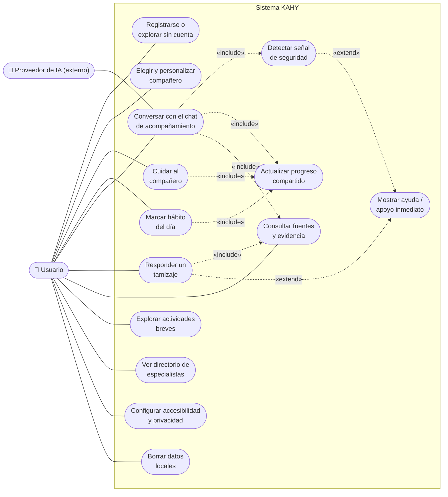
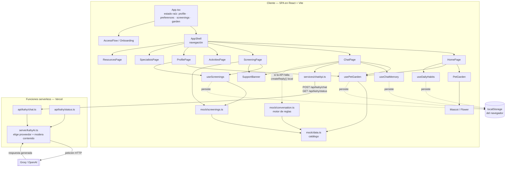
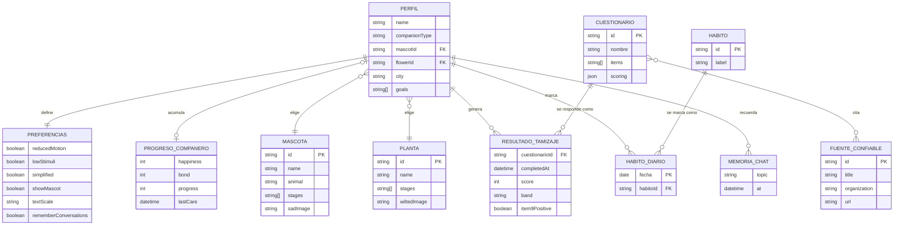
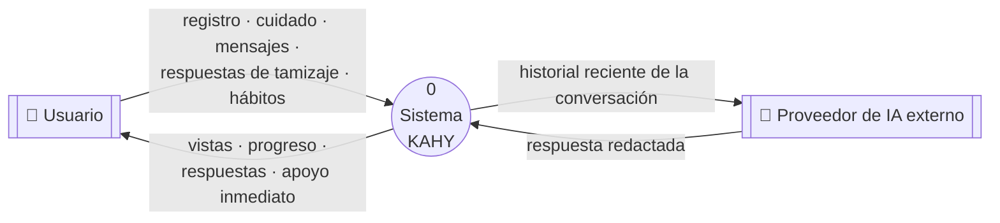
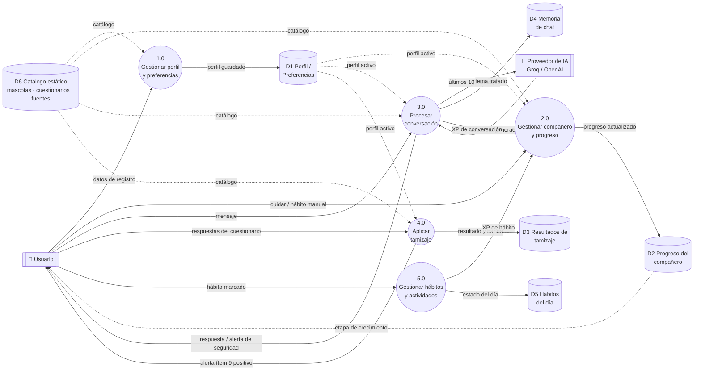

# Planos de KAHY — Diagramas técnicos

Documentación de arquitectura reconstruida a partir del código fuente real de la rama `main`: nombres de
componentes, hooks, claves de `localStorage` y rutas de API son literales del proyecto, no ilustrativos.

KAHY es un prototipo de primer auxilio psicológico: un chat de orientación con motor de reglas local, un
rincón de compañía con una mascota o planta que crece con el uso, y un módulo de autorreporte (PHQ-9, GAD-7,
ASRS, PCL-5) que nunca calcula un nivel de riesgo por sí solo. No tiene base de datos: todo se guarda en el
`localStorage` del dispositivo, salvo la generación de respuestas del chat, que pasa por una función
serverless hacia Groq/OpenAI.

- [1. Diagrama de casos de uso](#1-diagrama-de-casos-de-uso)
- [2. Arquitectura de componentes](#2-arquitectura-de-componentes)
- [3. Modelo entidad–relación](#3-modelo-entidad-relación)
- [4. Diagrama de flujo de datos](#4-diagrama-de-flujo-de-datos)

---

## 1. Diagrama de casos de uso

Un único actor principal —la persona usuaria, con o sin cuenta registrada— concentra casi toda la
interacción. El **proveedor de IA externo** (Groq u OpenAI) participa como actor secundario solo dentro de la
conversación: si no responde, KAHY sigue funcionando con su motor de reglas local. Dos relaciones `«extend»`
son deliberadas: la seguridad nunca es un caso de uso aparte que alguien elige, sino algo que se activa encima
de otro caso cuando el contenido lo amerita.

**Notas**

- *Actualizar progreso compartido* es el caso de uso más incluido: cuidar al compañero, marcar un hábito y
  conversar en el chat alimentan el **mismo** contador de crecimiento (`usePetGarden`), no tres sistemas
  separados.
- *Consultar fuentes y evidencia* se reutiliza desde el chat, el tamizaje y la biblioteca de recursos: toda
  afirmación remite al mismo catálogo verificado (`trustedSources`).
- ⚠️ *Mostrar ayuda / apoyo inmediato* nunca se activa por elección del usuario: se extiende automáticamente
  desde *Detectar señal de seguridad* (frase explícita en el chat) o desde cualquier respuesta positiva al
  ítem 9 del PHQ-9 en el tamizaje.

---

## 2. Arquitectura de componentes

Todo el estado con significado —perfil, preferencias, resultados de tamizaje y el progreso del compañero—
vive en `App.tsx` y baja por props a las páginas, siguiendo el mismo patrón para los cuatro. No hay base de
datos: cuatro hooks distintos son quienes de verdad hablan con `localStorage`. El chat es la única pieza que
sale del navegador, y solo para pedir una respuesta redactada; si la función serverless no responde, cae de
inmediato a su propio motor de reglas.

**Notas**

- Cinco claves distintas de `localStorage` — `kahy.registration.v1`, `kahy.pet-garden.v1`,
  `kahy.screenings.v1`, `kahy.chat-memory.v1`, `kahy.daily-habits.v1` — cada una detrás de su propio hook,
  ninguna compartida directamente entre componentes.
- `server/kahyAi.ts` prioriza **Groq** sobre **OpenAI** según qué variable de entorno exista, y añade una capa
  de moderación antes de responder.
- El mismo módulo `mock/conversation.ts` sirve dos rutas: es el *fallback* del cliente cuando la IA falla, y
  la fuente de la que se nutre el propio servidor al construir el contexto de seguridad.

---

## 3. Modelo entidad–relación

KAHY no tiene servidor de datos: este es el modelo **lógico** que subyace a los objetos JSON guardados en el
dispositivo, no un esquema de tablas. Se dibuja como entidad–relación porque es la manera más clara de
mostrar algo que el código ya hace cumplir: un perfil solo puede tener *una* mascota y *una* planta activas a
la vez, y comparte un único progreso sin importar cuál esté eligiendo en un momento dado.

**Notas**

- `PROGRESO_COMPANERO` se relaciona una sola vez con `PERFIL`: el mismo `progress` crece sin importar si en
  ese momento el perfil apunta a una mascota o a una planta.
- El campo `item9Positive` en `RESULTADO_TAMIZAJE` es booleano, no una escala de riesgo — se calcula solo para
  el PHQ-9 y solo dispara la interfaz de apoyo, nunca una clasificación.
- `CUESTIONARIO` y `FUENTE_CONFIABLE` tienen relación muchos-a-muchos: cada instrumento cita entre 2 y 3
  fuentes (UNAM, NICE, Harvard/OMS) que la interfaz despliega junto al resultado.

---

## 4. Diagrama de flujo de datos

Nivel 0 primero, para ubicar el sistema completo frente a sus dos únicos límites externos; luego el nivel 1,
que abre esa burbuja en los cinco procesos reales del código y los seis almacenes de datos que efectivamente
escribe (cinco en `localStorage`, uno estático en el propio bundle).

### 4a. Nivel 0 — diagrama de contexto

### 4b. Nivel 1 — procesos y almacenes

**Leyenda:** círculo = proceso · cilindro = almacén de datos · rectángulo doble = entidad externa.

**Notas**

- `2.0 Gestionar compañero y progreso` es el único proceso que escribe en `D2`, y lo alimentan tres flujos
  distintos (cuidado directo, hábito, chat) — es el mismo mecanismo detrás de
  `usePetGarden().gainFromHabit()` y `gainFromChat()`.
- El flujo `P3 → IA` nunca incluye el texto completo del historial: solo los últimos 10 turnos, resumidos, y
  sin nombre, domicilio ni otros identificadores.

> **Ruta de seguridad, fuera del flujo normal.** Tanto `3.0` como `4.0` pueden emitir una alerta de seguridad
> directo al usuario sin pasar por ningún almacén de datos intermedio ni por el proveedor de IA: una frase
> explícita en el chat, o un ítem 9 positivo en el PHQ-9, muestran la Línea de la Vida (800 911 2000) de
> inmediato. El sistema nunca calcula ni persiste un nivel de riesgo — solo decide, en el momento, si mostrar
> ese recurso.
